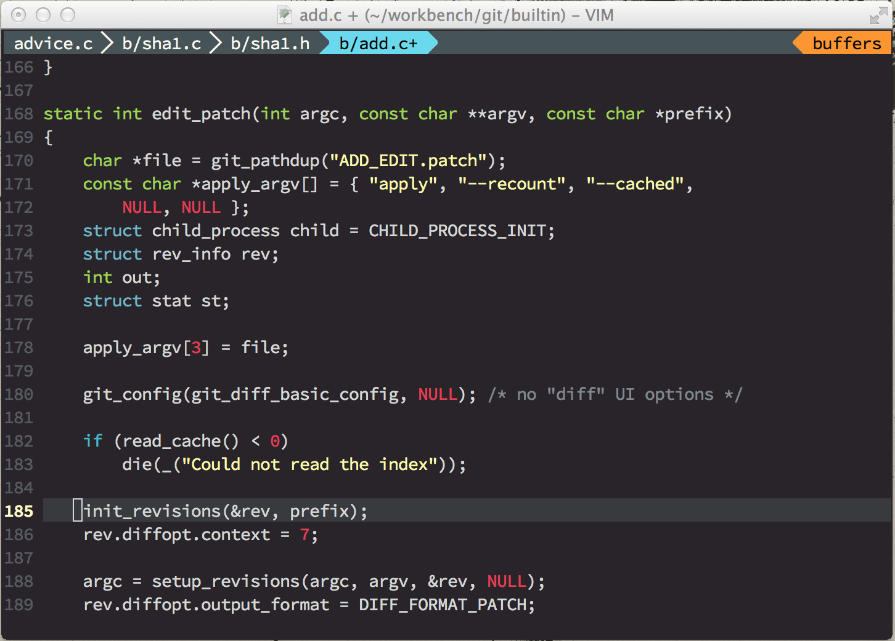

vim-monokai
===========

A monokai color scheme for Vim.

* The colour palette from [colourlovers](http://www.colourlovers.com/). 
* The code from [hybrid.vim](https://github.com/w0ng/vim-hybrid).
* Terminal supported.

Install
===========

### Vundle

    Plugin 'crusoexia/vim-monokai'

Usage
===========

Type below command in your vim or save it in your vimrc:

    colorscheme monokai

v1.0
===========

If you like the original green strings, checkout the v1.0 version:

    cd ~/.vim/bundle/vim-monokai && git checkout v1.0

Screenshots
===========

### NERDTree

### C

### JavaScript

### CSS

### HTML

