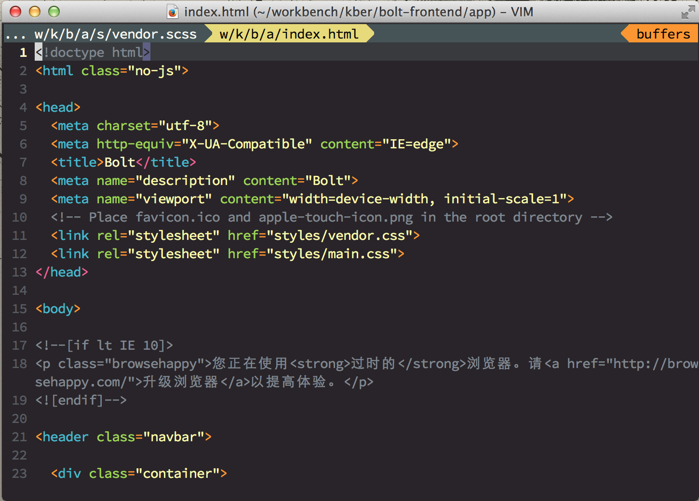

vim-monokai
===========

Refined monokai color scheme for vim. 

* The colour palette from [sickill/vim-monokai](https://github.com/sickill/vim-monokai). 

Install
-------

### [vim-plug](https://github.com/junegunn/vim-plug)

    Plug 'crusoexia/vim-monokai'

Usage
-----

Copy below command to your `~/.vimrc`:

```VimL
syntax on
colorscheme monokai
```

Terminal support
----------------

If you are using a terminal which support truecolor like **iterm2**, enable the gui color by adding below setting in `~/.vimrc` or `~/.vim/init.vim`

```VimL
set termguicolors
```

Otherwise, use below setting to activate the 256 color in terminal

```VimL
set t_Co=256  " vim-monokai now only support 256 colours in terminal.
```

Configuration
-------------

### Italic

By default the gui enables italic but terminal. They both can be configured.
    
If you are using a font support italic, paste below command in `.vimrc` to turn on terminal italic:

    let g:monokai_term_italic = 1
    let g:monokai_gui_italic = 1

Javascript
----------

For javascript development, it is recommend to install below plugins:

1. [vim-javascript](https://github.com/pangloss/vim-javascript), which provide features such as param syntax highlight, 
function assignment identifier highlight ( just as the screenshots ).

2. [vim-javascript-lib](https://github.com/crusoexia/vim-javascript-lib), which is the companion of _vim-javascript_, 
provide the popular javascript libraries key word highlight, such as [underscore](http://underscorejs.org/) and 
[Backbone](http://backbonejs.org/).

Screenshots
-----------



