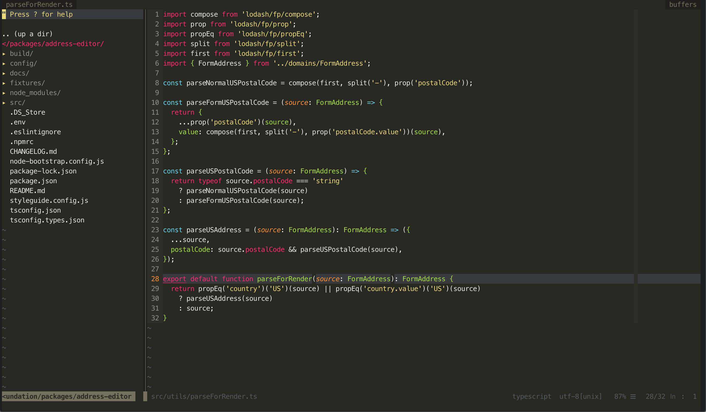

vim-monokai
===========

Refined monokai color scheme for vim. 

Install
-------

### [vim-plug](https://github.com/junegunn/vim-plug)

    Plug 'crusoexia/vim-monokai'

### Manually

```bash
mkdir -p ~/.vim/colors
```
    
Download the `colors/monokai.vim` file from the repo to `~/.vim/colors`

Usage
-----

Copy below command to your `~/.vimrc`:

```VimL
syntax on
colorscheme monokai
```

Terminal support
----------------

If you are using a terminal which support truecolor like **iterm2**, enable the gui color by adding below setting in `~/.vimrc` or `~/.vim/init.vim`

```VimL
set termguicolors
```

Otherwise, use below setting to activate the 256 color in terminal

```VimL
set t_Co=256  " vim-monokai now only support 256 colours in terminal.
```

coc.nvim support
----------------

[coc.nvim](https://github.com/neoclide/coc.nvim) is a powerful completion engine, it brings *vs-code*'s experience into vim. *vim-monokai* fits it well.

Configuration
-------------

### Italic

By default the gui enables italic but terminal. They both can be configured.
    
If you are using a font support italic, paste below command in `.vimrc` to turn on terminal italic:

    let g:monokai_term_italic = 1
    let g:monokai_gui_italic = 1

Recommend syntax plugins
------------------------

Below plugins would give you better experience when using *vim-monokai*:

| Language     | Plugins                                                                                                                               |
| ------------ | --------------------------------------                                                                                                |
| Javascript   | [vim-javascript](https://github.com/pangloss/vim-javascript)<br>[vim-javascript-lib](https://github.com/crusoexia/vim-javascript-lib) |
| Typescript   | [yats.vim](https://github.com/HerringtonDarkholme/yats.vim)                                                                           |
| Dart         | [dart-vim-plugin](https://github.com/dart-lang/dart-vim-plugin)                                                                       |
| JSX          | [vim-jsx-pretty](https://github.com/MaxMEllon/vim-jsx-pretty)                                                                         |
| Markdown     | [vim-markdown](https://github.com/tpope/vim-markdown)                                                                                 |

Screenshots
-----------




