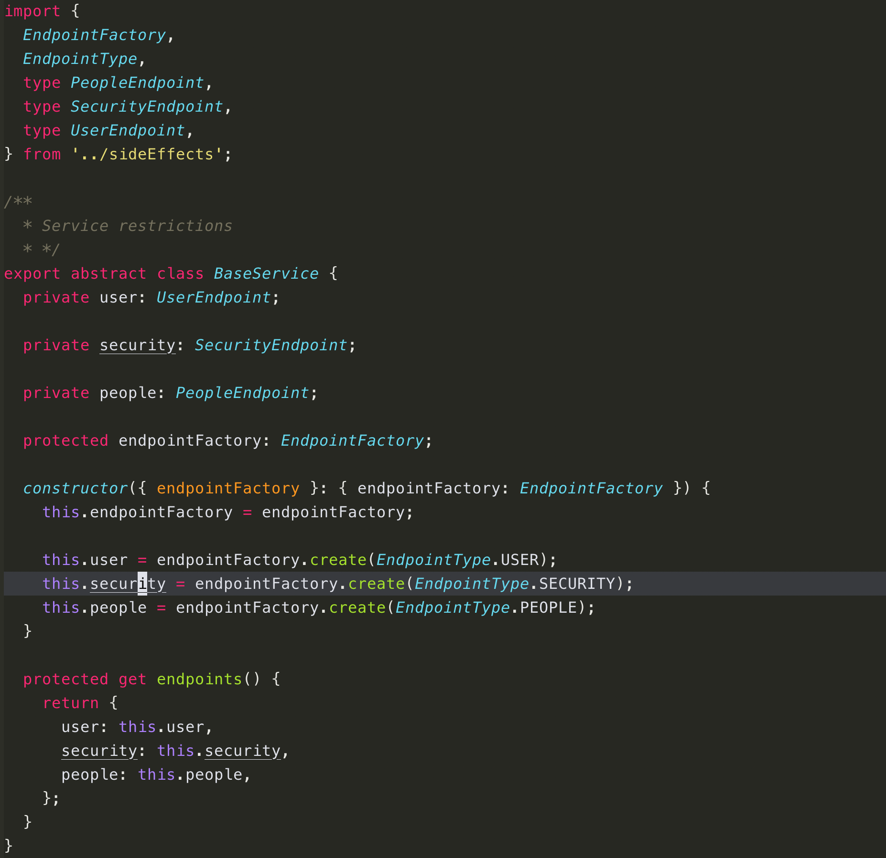

vim-monokai
===========

Refined monokai color scheme for vim. 

Install
-------

### [vim-plug](https://github.com/junegunn/vim-plug)

    Plug 'crusoexia/vim-monokai'

### Manually

```bash
mkdir -p ~/.vim/colors
```
    
Download the `colors/monokai.vim` file from the repo to `~/.vim/colors`

Usage
-----

Copy below command to your `~/.vimrc`:

```VimL
syntax on
colorscheme monokai
```

Terminal support
----------------

If you are using a terminal which support truecolor like **iterm2**, enable the gui color by adding below setting in `~/.vimrc` or `~/.vim/init.vim`

```VimL
set termguicolors
```

Otherwise, use below setting to activate the 256 color in terminal

```VimL
set t_Co=256  " vim-monokai now only support 256 colours in terminal.
```

coc.nvim support
----------------

[coc.nvim](https://github.com/neoclide/coc.nvim) is a powerful completion engine, it brings *vs-code*'s experience into vim. *vim-monokai* fits it well.

Configuration
-------------

### Italic

If you are using a font which support italic, paste below command in `.vimrc` to turn on gui/terminal italic effect:

    let g:monokai_term_italic = 1
    let g:monokai_gui_italic = 1

> Note: If you are using vim with [tmux](https://github.com/tmux/tmux/wiki), you need to turn-off the italic. __tmux__ doesn't support italic font, all _italic_ effect will become _"reverse"_.

Recommend syntax plugins
------------------------

### nvim-treesitter

It is recommend to use [nvim-treesitter](https://github.com/nvim-treesitter/nvim-treesitter)
for general language syntax mapping. **vim-monokai** tweaked to fit _treesitter_'s 
highlight groups.

> Currently `nvim-treesitter` only support `neovim`.

#### treesitter configuration

To enable treesitter's highlight group, add below configuration to your `init.vim`:

```VimScript
lua << EOF
require'nvim-treesitter.configs'.setup {
  highlight = {
    enable = true,
  },
}
EOF
```

Refer to [treesitter highlight](https://github.com/nvim-treesitter/nvim-treesitter?tab=readme-ov-file#highlight).

### Other syntax plugins

Below plugins would give you better experience when using *vim-monokai*:

| Language     | Plugins                                                                                                                               |
| ------------ | --------------------------------------                                                                                                |
| Javascript   | [vim-javascript](https://github.com/pangloss/vim-javascript)<br>[vim-javascript-lib](https://github.com/crusoexia/vim-javascript-lib) |
| Typescript   | [yats.vim](https://github.com/HerringtonDarkholme/yats.vim)                                                                           |
| Dart         | [dart-vim-plugin](https://github.com/dart-lang/dart-vim-plugin)                                                                       |
| JSX          | [vim-jsx-pretty](https://github.com/MaxMEllon/vim-jsx-pretty)                                                                         |
| Markdown     | [vim-markdown](https://github.com/tpope/vim-markdown)                                                                                 |

Windows terminal
----------------

Matched __Windows Terminal__ color scheme:

```json
{
  "background": "#272822",
  "black": "#272822",
  "blue": "#AE81FF",
  "brightBlack": "#383A3E",
  "brightBlue": "#AE81FF",
  "brightCyan": "#66D9EF",
  "brightGreen": "#A6E22D",
  "brightPurple": "#F92772",
  "brightRed": "#F92772",
  "brightWhite": "#E8E8E3",
  "brightYellow": "#E6DB74",
  "cursorColor": "#E8E8E3",
  "cyan": "#66D9EF",
  "foreground": "#E8E8E3",
  "green": "#A6E22D",
  "name": "Monokai",
  "purple": "#F92772",
  "red": "#E73C50",
  "selectionBackground": "#FFFFFF",
  "white": "#D8D8D3",
  "yellow": "#FD9720"
}
```

Screenshots
-----------

_With treesitter_



_With other syntax plugins_


