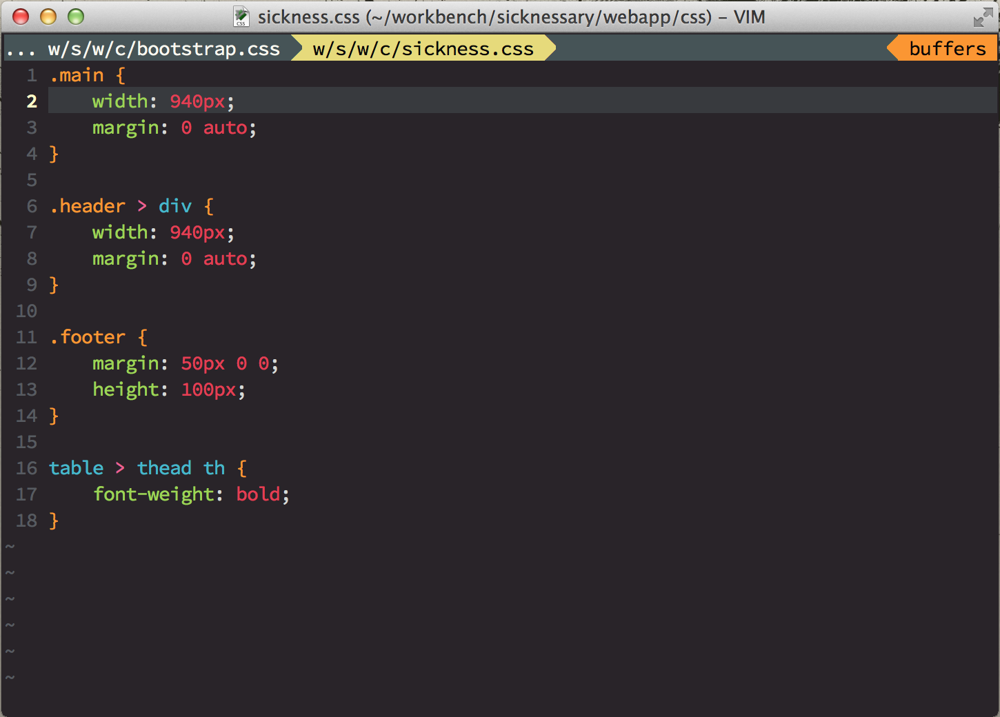

vim-monokai
===========

A vim monokai color scheme for _Web developers_.

* The RGB colour palette is taken from [colourlovers](http://www.colourlovers.com/). 
* The Syntax highlighting and the code are taken from [hybrid.vim](https://github.com/w0ng/vim-hybrid).
* Terminal supported.

Install
===========

### Vundle

    Plugin 'crusoexia/vim-monokai'

Usage
===========

Type below command in your vim or save it in your vimrc:

    colorscheme monokai

Recommend plugins
===========

Below plugins can make it works better for JavaScript and Html, install them with Vundle.

    Plugin 'scrooloose/syntastic'                       " general language syntax highlight
    Plugin 'groenewege/vim-less'                        " less syntax highlight
    Plugin 'pangloss/vim-javascript'                    " javascript syntax and indent
    Plugin 'jelera/vim-javascript-syntax'               " javascript enhanced syntax highlight
    Plugin 'othree/javascript-libraries-syntax.vim'     " javascript library highlight
    Plugin 'othree/html5-syntax.vim'                    " html5 tag and properties highlight

___Note___: please keep the plugins' order as the same as the above list in your `.vimrc` to make sure your
highlight will look the same as the screenshots.

Screenshots
===========

### JavaScript

### CSS

### HTML

